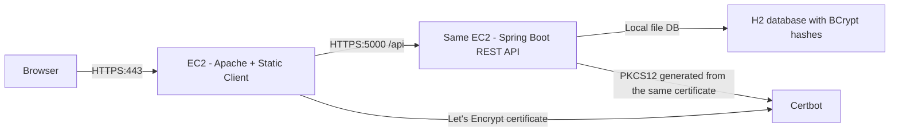

# Secure Application Design Lab

This repository contains a complete base solution for the secure application workshop:

- Apache serves the asynchronous HTML and JavaScript client over HTTPS.
- Spring Boot exposes REST endpoints over HTTPS.
- Passwords are stored as BCrypt hashes.
- The browser authenticates with a login flow and uses Bearer tokens for protected requests.
- Deployment is simplified to one AWS EC2 instance with Apache and Spring running on the same machine.

## Repository Structure

- `apache/site/`: static client files to publish on the Apache server.
- `deploy/apache/secureapp.conf`: Apache virtual host with HTTPS and reverse proxy to Spring.
- `deploy/spring/secureapp.service`: `systemd` unit for the Spring backend.
- `deploy/scripts/`: helper scripts for keystore generation.
- `src/main/java/`: Spring Boot backend.
- `docs/architecture.md`: architecture design document.
- `docs/aws-deployment.md`: AWS and TLS deployment guide.
- `docs/video-checklist.md`: suggested script for the final demo video.

## Simplified Architecture



This is the easiest deployment path because you already have `arepecilab.duckdns.org` and Apache working on one EC2.

## Backend Features

- `POST /api/auth/register`: creates a user and stores the password as a BCrypt hash.
- `POST /api/auth/login`: validates credentials and returns a Bearer token.
- `POST /api/auth/logout`: invalidates the active token.
- `GET /api/public/info`: public endpoint to confirm HTTPS connectivity.
- `GET /api/secure/profile`: protected endpoint with account data.
- `GET /api/secure/status`: protected endpoint proving authenticated access.

## Local Execution

### 1. Build

```bash
mvn clean package
```

### 2. Run locally with the bundled self-signed keystore

```bash
mvn spring-boot:run
```

The default backend URL is `https://localhost:5000`.

### 3. Publish the client on Apache

Copy everything from `apache/site/` to your Apache document root, for example:

```bash
sudo mkdir -p /var/www/secureapp
sudo cp -r apache/site/* /var/www/secureapp/
```

## Configuration

Important environment variables:

- `PORT`: backend port, default `5000`.
- `SERVER_SSL_ENABLED`: enable or disable TLS on Spring.
- `SERVER_SSL_KEY_STORE`: PKCS12 file path for the Spring certificate.
- `SERVER_SSL_KEY_STORE_PASSWORD`: keystore password.
- `SERVER_SSL_KEY_ALIAS`: certificate alias.
- `SPRING_DATASOURCE_URL`: default is a file-based H2 database.
- `APP_ALLOWED_ORIGINS`: allowed origins for direct cross-origin tests. When using Apache reverse proxy, keep it as the Apache hostname.
- `APP_SESSION_TTL`: token TTL, default `30m`.

## Deployment on AWS

Use the detailed instructions in [docs/aws-deployment.md](/C:/Users/jesjc/OneDrive/Documentos/secureapp/docs/aws-deployment.md).

High-level flow:

1. Keep Apache on the current EC2 and install the virtual host from `deploy/apache/secureapp.conf`.
2. Build the Spring jar and copy it to `/opt/secureapp/`.
3. Reuse the same Let's Encrypt certificate from Apache and convert it into PKCS12 with `deploy/scripts/build-pkcs12-from-letsencrypt.sh`.
4. Install the `systemd` service from `deploy/spring/secureapp.service`.
5. Start Spring on `127.0.0.1:5000` with TLS enabled.
6. Let Apache proxy `/api` to the local Spring service.

## Evidence to Include in the Final Submission

- GitHub repository with this codebase and your deployment notes.
- Updated README with the final public URLs and screenshots.
- Screenshots proving:
  - Apache loads the client over HTTPS.
  - Login works.
  - Protected requests reach Spring over HTTPS.
  - Apache and Spring are both using TLS on the same EC2.
- A short demo video using the checklist in [docs/video-checklist.md](/C:/Users/jesjc/OneDrive/Documentos/secureapp/docs/video-checklist.md).
