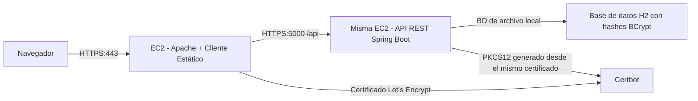

# Laboratorio de Diseño de Aplicación Segura

Este repositorio contiene una solución base completa para el taller de aplicación segura:

- Apache sirve el cliente HTML y JavaScript asíncrono sobre HTTPS.
- Spring Boot expone endpoints REST sobre HTTPS.
- Las contraseñas se almacenan como hashes BCrypt.
- El navegador se autentica con un flujo de inicio de sesión y usa tokens Bearer para solicitudes protegidas.
- El despliegue se simplifica a una sola instancia AWS EC2 con Apache y Spring ejecutándose en la misma máquina.

## Estructura del Repositorio

- `apache/site/`: archivos estáticos del cliente para publicar en el servidor Apache.
- `deploy/apache/secureapp.conf`: host virtual de Apache con HTTPS y proxy inverso hacia Spring.
- `deploy/spring/secureapp.service`: unidad `systemd` para el backend Spring.
- `deploy/scripts/`: scripts de apoyo para generación de keystore.
- `src/main/java/`: backend de Spring Boot.
- `docs/architecture.md`: documento de diseño de arquitectura.
- `docs/aws-deployment.md`: guía de despliegue en AWS y TLS.
- `docs/video-checklist.md`: guion sugerido para el video final de demostración.
- `img/demosecureapp.mp4`: video de demostración final del proyecto.

## Arquitectura Simplificada



Esta es la ruta de despliegue más simple porque ya cuentas con `arepnat.duckdns.org` y Apache funcionando en una sola EC2.

## Funcionalidades del Backend

- `POST /api/auth/register`: crea un usuario y almacena la contraseña como hash BCrypt.
- `POST /api/auth/login`: valida credenciales y devuelve un token Bearer.
- `POST /api/auth/logout`: invalida el token activo.
- `GET /api/public/info`: endpoint público para confirmar conectividad HTTPS.
- `GET /api/secure/profile`: endpoint protegido con datos de la cuenta.
- `GET /api/secure/status`: endpoint protegido que demuestra acceso autenticado.

## Ejecución Local

### 1. Compilar

```bash
mvn clean package
```

### 2. Ejecutar localmente con el keystore autofirmado incluido

```bash
mvn spring-boot:run
```

La URL predeterminada del backend es `https://localhost:5000`.

### 3. Publicar el cliente en Apache

Copia todo el contenido de `apache/site/` al document root de Apache, por ejemplo:

```bash
sudo mkdir -p /var/www/secureapp
sudo cp -r apache/site/* /var/www/secureapp/
```

## Configuración

Variables de entorno importantes:

- `PORT`: puerto del backend, valor predeterminado `5000`.
- `SERVER_SSL_ENABLED`: habilita o deshabilita TLS en Spring.
- `SERVER_SSL_KEY_STORE`: ruta del archivo PKCS12 para el certificado de Spring.
- `SERVER_SSL_KEY_STORE_PASSWORD`: contraseña del keystore.
- `SERVER_SSL_KEY_ALIAS`: alias del certificado.
- `SPRING_DATASOURCE_URL`: por defecto usa una base de datos H2 basada en archivo.
- `APP_ALLOWED_ORIGINS`: orígenes permitidos para pruebas directas de CORS. Si usas proxy inverso de Apache, mantenlo con el hostname de Apache.
- `APP_SESSION_TTL`: tiempo de vida del token, por defecto `30m`.

## Despliegue en AWS

Usa las instrucciones detalladas en [docs/aws-deployment.md](docs/aws-deployment.md).

Flujo general:

1. Mantén Apache en la EC2 actual e instala el host virtual desde `deploy/apache/secureapp.conf`.
2. Compila el jar de Spring y cópialo a `/opt/secureapp/`.
3. Reutiliza el mismo certificado de Let's Encrypt de Apache y conviértelo a PKCS12 con `deploy/scripts/build-pkcs12-from-letsencrypt.sh`.
4. Instala el servicio `systemd` desde `deploy/spring/secureapp.service`.
5. Inicia Spring en `127.0.0.1:5000` con TLS habilitado.
6. Deja que Apache haga proxy de `/api` al servicio local de Spring.

## Evidencia para la Entrega Final

- Repositorio de GitHub con esta base de código y tus notas de despliegue.
- README actualizado con las URLs públicas finales y capturas de pantalla.
- Capturas que demuestren:
  - Apache carga el cliente sobre HTTPS.
  - El inicio de sesión funciona.
  - Las solicitudes protegidas llegan a Spring sobre HTTPS.
  - Apache y Spring están usando TLS en la misma EC2.
- Video de demostración incluido en el repositorio: [img/demosecureapp.mp4](img/demosecureapp.mp4).
- Guion usado para la grabación: [docs/video-checklist.md](docs/video-checklist.md).
