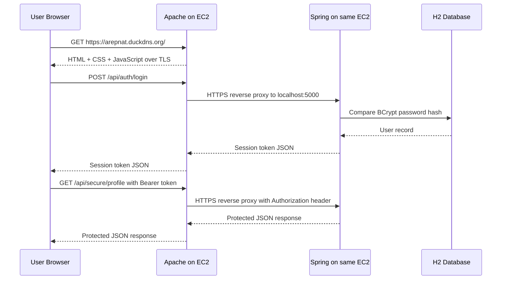

# Application Architecture Design

## Objective

Design and deploy a secure web application on AWS using one EC2 instance with two application layers:

- Apache for secure delivery of the asynchronous HTML and JavaScript client.
- Spring Boot for secure REST services and user authentication.

## Components

### 1. Apache server

- Runs on an EC2 instance with Amazon Linux 2023.
- Hosts static files from `apache/site/`.
- Terminates TLS for the public site using Let's Encrypt.
- Reverse proxies `/api` traffic to the local Spring backend through HTTPS.

### 2. Spring Boot server

- Runs on the same EC2 instance as Apache.
- Exposes REST endpoints over HTTPS only.
- Stores users in H2 and hashes passwords using BCrypt before persisting them.
- Issues random Bearer session tokens after successful login.
- Binds to `127.0.0.1:5000` to stay internal to the machine.

### 3. Browser client

- Loads HTML, CSS, and JavaScript from Apache over HTTPS.
- Uses `fetch` with `async/await` to call the backend asynchronously.
- Stores the Bearer token in `sessionStorage` for the current browser tab only.

## Logical Relationship Between Components

## Security Decisions

### TLS

- Apache uses a public Let's Encrypt certificate for `arepnat.duckdns.org`.
- Spring reuses that same certificate after converting it to PKCS12.
- Apache proxies to Spring with HTTPS on `127.0.0.1:5000`.

### Password storage

- Passwords are never stored in plain text.
- The backend uses BCrypt through Spring Security's `PasswordEncoder`.
- During login, the submitted password is compared with the stored hash.

### Authentication

- Public endpoints are limited to registration, login, and a public info endpoint.
- Successful login returns a cryptographically strong random session token.
- Protected endpoints require `Authorization: Bearer <token>`.
- Tokens expire automatically according to `APP_SESSION_TTL`.

### Configuration management

- Sensitive or environment-specific values are injected by environment variables.
- Certificates are not hardcoded in the Java code.
- The keystore password is expected to come from `systemd` environment configuration on the application service.

## AWS Secure Deployment Strategy

### Recommended networking

- Security group inbound rules:
  - `22` for SSH from your admin IP.
  - `80` and `443` from the Internet.
- Do not expose port `5000` publicly.
- Spring stays local by listening on `127.0.0.1`.

### OS hardening basics for the lab

- Use a dedicated Linux user for the application process when possible.
- Run Spring as a `systemd` service instead of an interactive shell.
- Keep certificates under `/opt/secureapp/certs/` with restricted permissions.
- Avoid embedding secrets in the repository.

## Why This Architecture Matches the Rubric

- Apache and Spring are separated into different services.
- TLS protects client downloads and backend API traffic.
- Login uses hashed password storage.
- The client is asynchronous and browser-based.
- The deployment strategy is directly aligned with AWS EC2 and Let's Encrypt.
