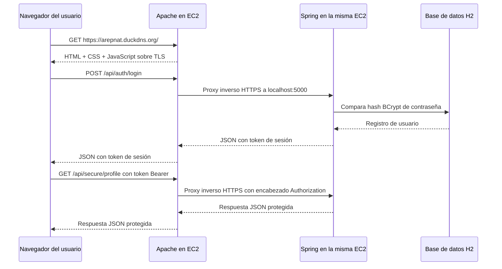

# Diseño de Arquitectura de la Aplicación

## Objetivo

Diseñar y desplegar una aplicación web segura en AWS usando una instancia EC2 con dos capas de aplicación:

- Apache para la entrega segura del cliente HTML y JavaScript asíncrono.
- Spring Boot para servicios REST seguros y autenticación de usuarios.

## Componentes

### 1. Servidor Apache

- Se ejecuta en una instancia EC2 con Amazon Linux 2023.
- Aloja archivos estáticos desde `apache/site/`.
- Termina TLS para el sitio público usando Let's Encrypt.
- Hace proxy inverso del tráfico `/api` hacia el backend local de Spring por HTTPS.

### 2. Servidor Spring Boot

- Se ejecuta en la misma instancia EC2 que Apache.
- Expone endpoints REST solo sobre HTTPS.
- Guarda usuarios en H2 y aplica hash BCrypt a las contraseñas antes de persistirlas.
- Emite tokens de sesión Bearer aleatorios tras un inicio de sesión exitoso.
- Se enlaza a `127.0.0.1:5000` para permanecer interno a la máquina.

### 3. Cliente en el navegador

- Carga HTML, CSS y JavaScript desde Apache por HTTPS.
- Usa `fetch` con `async/await` para llamar al backend de forma asíncrona.
- Guarda el token Bearer en `sessionStorage` solo para la pestaña actual del navegador.

## Relación Lógica Entre Componentes

## Decisiones de Seguridad

### TLS

- Apache usa un certificado público de Let's Encrypt para `arepnat.duckdns.org`.
- Spring reutiliza ese mismo certificado tras convertirlo a PKCS12.
- Apache hace proxy a Spring con HTTPS en `127.0.0.1:5000`.

### Almacenamiento de contraseñas

- Las contraseñas nunca se almacenan en texto plano.
- El backend usa BCrypt mediante `PasswordEncoder` de Spring Security.
- Durante el login, la contraseña enviada se compara con el hash almacenado.

### Autenticación

- Los endpoints públicos se limitan a registro, login y un endpoint de información pública.
- Un login exitoso devuelve un token de sesión aleatorio criptográficamente robusto.
- Los endpoints protegidos requieren `Authorization: Bearer <token>`.
- Los tokens expiran automáticamente según `APP_SESSION_TTL`.

### Gestión de configuración

- Los valores sensibles o específicos de entorno se inyectan por variables de entorno.
- Los certificados no están codificados directamente en el código Java.
- Se espera que la contraseña del keystore provenga de la configuración de entorno de `systemd` en el servicio de la aplicación.

## Estrategia de Despliegue Seguro en AWS

### Red recomendada

- Reglas de entrada del Security Group:
  - `22` para SSH desde tu IP de administración.
  - `80` y `443` desde Internet.
- No expongas el puerto `5000` públicamente.
- Spring permanece local escuchando en `127.0.0.1`.

### Endurecimiento básico del SO para el laboratorio

- Usa un usuario Linux dedicado para el proceso de la aplicación cuando sea posible.
- Ejecuta Spring como servicio `systemd` en lugar de una consola interactiva.
- Mantén certificados en `/opt/secureapp/certs/` con permisos restringidos.
- Evita incluir secretos dentro del repositorio.

## Por Qué Esta Arquitectura Cumple la Rúbrica

- Apache y Spring están separados en servicios distintos.
- TLS protege la descarga del cliente y el tráfico de API del backend.
- El login usa almacenamiento de contraseñas con hash.
- El cliente es asíncrono y basado en navegador.
- La estrategia de despliegue está alineada directamente con AWS EC2 y Let's Encrypt.
